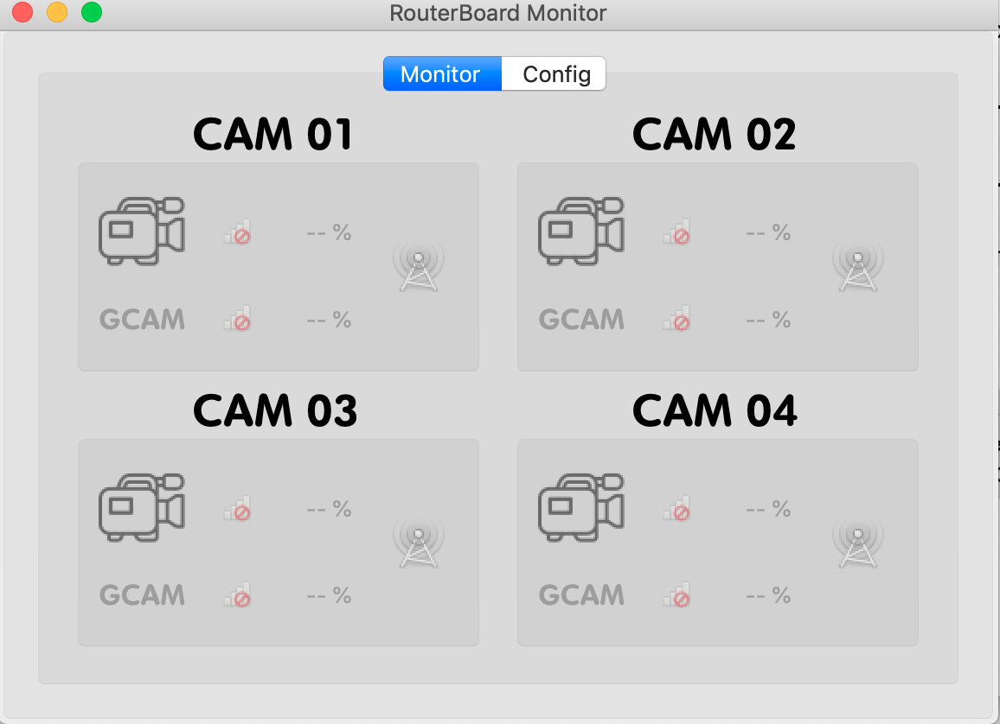
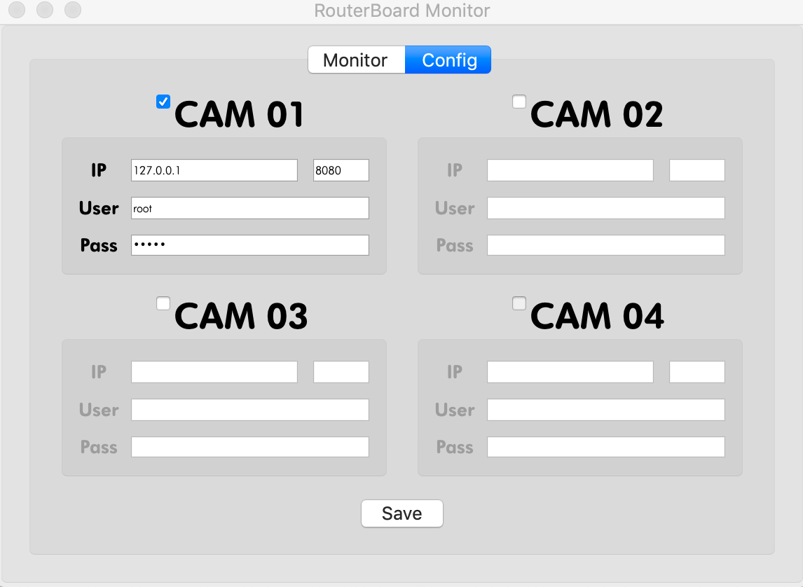

# RouterBoard Monitor

---

| &nbsp;[](https://opensource.org/licenses/MIT)&nbsp;&nbsp; |

---

### About
> Small App to monitor the wifi connection between devices with routerboard equipment.

### Documentation

Monitor Interface:
<p align="center" >
    
</p>

Config Interface:
<p align="center" >
    
</p>

### Build Setup &nbsp; :construction:

``` 
pip install -r requirements.txt
```

### Getting started &nbsp;:running:

``` 
python start.py
```

### Build the exe file &nbsp; :construction:

``` 
pyinstaller -y -F -w -i "app/main/resource/routericon.ico" "start.py"
```


### Built With

* [PyQt5](https://www.riverbankcomputing.com/software/pyqt/intro) - set of Python v2 and v3 bindings for The Qt Company's Qt application framework.
* [Requests](https://2.python-requests.org//en/master/#) - Non-GMO HTTP library for Python, safe for human consumption.

## Authors

* **Gustavo Silva** - *Initial work* - [routerboard](https://github.com/gusilva/routerboard)

## License

This project is licensed under the MIT License - see the LICENSE.md file for details

